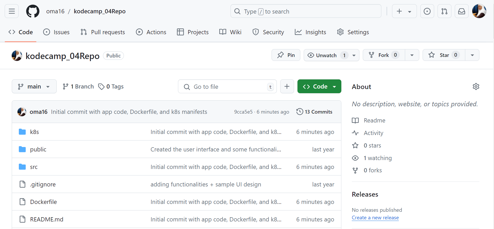

# Setting up a CI/CD pipeline with GitHub Actions to deploy a code from GitHub to a Minikube cluster running on an EC2 instance deployed using Terraform.

## Prepared the Code Repository

### Created a Repository on GitHub

### Added Application Code

Created a dockerfile [dockerfile](Dockerfile)

build the image 

pushed the image

[dockerhubURL](https://hub.docker.com/r/oma16/githubusersearch-app)

created directory k8s and added [deployment.yaml](k8s/deployment.yaml) and [service.yaml](k8s/service.yaml) files

pushed the application code to github

## Setting Up GitHub Actions

### Created a GitHub Actions Workflow

Created a .github/workflows directory and a YAML file (deploy.yml) inside this directory with the required configurations

## Setting Up Terraform for EC2 and Minikube

### Created Terraform Module

VPC modules [terraform/modules/vpc](terraform/modules/vpc)

EC2 modules [terraform/modules/ec2](terraform/modules/ec2)

### Initialized and Applied Terraform Configuration

terraform init

terraform plan -out "tfplan.txt"

terraform apply "tfplan.txt"

## Accessed the Minikube Cluster

### SSH into EC2 Instance

### minikube

### Configure kubectl

## Automate Deployment with GitHub Actions

### Update GitHub Actions Workflow

